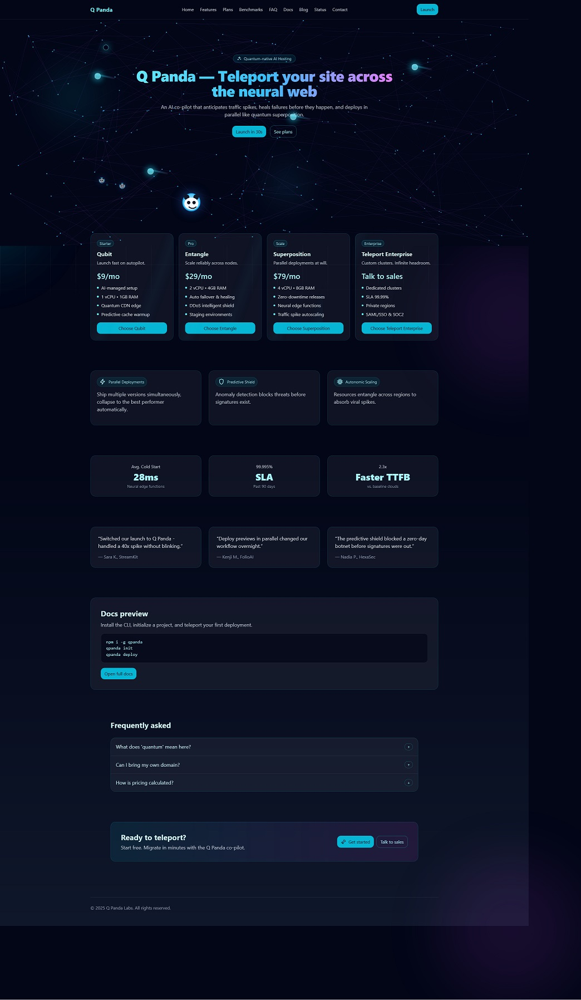

<div align="center">



# 🐼 Q Panda

**Quantum-native AI Hosting Platform**

*Teleport your site across the neural web*

[](https://nextjs.org/)
[](https://reactjs.org/)
[](https://www.framer.com/motion/)
[](https://tailwindcss.com/)

[🚀 Live Demo](#) • [📖 Documentation](./WARP.md) • [🎯 Features](#features)

---

</div>

## ✨ Overview

Q Panda is an **interactive demo showcasing a quantum-native AI hosting platform**. Built with Next.js 14, it features stunning animations, a custom canvas background with moving quantum nodes, and an animated panda mascot that teleports around the screen with spectacular visual effects.

### 🎭 What Makes It Special

- **🎨 Interactive Quantum Canvas** - Real-time physics simulation with node networks and photon streams
- **🐼 Animated Mascot** - A floating panda with teleportation effects, particle trails, and clones
- **⚡ Complex Animations** - Advanced Framer Motion choreography with parallax and spring physics
- **🎯 Plan Selection System** - Interactive orbs that trigger coordinated visual effects
- **🌐 Hash-based Routing** - Smooth client-side navigation for blog, contact, and status pages
- **📱 Responsive Design** - Glassmorphism UI with dark theme and cyan/fuchsia accents

## 🎯 Features

<table>
<tr>
<td width="50%">

### 🖼️ Visual Effects
- **Quantum Network Background** with moving nodes
- **Particle Systems** for trails and disintegration
- **Teleportation Rings** with expansion animations
- **Mouse Parallax** interactive layers
- **Shimmer Effects** on UI elements

</td>
<td width="50%">

### 🎮 Interactions
- **Plan-specific Animations** (Entangle, Superposition, etc.)
- **Modal System** with backdrop blur
- **Scroll Parallax** effects
- **Deep Linking** support
- **Error Boundaries** with graceful fallbacks

</td>
</tr>
</table>

## 🚀 Quick Start

### Prerequisites
- **Node.js** 18+ 
- **npm** or **yarn**

### Installation

```bash
# Clone the repository
git clone <your-repo-url>
cd qpanda

# Install dependencies
npm install
```

### Development

> ⚠️ **Important**: Never run `npm run dev` directly in the main terminal - it takes over the session!

**Windows PowerShell:**
```powershell
# Start development server in new window
Start-Process pwsh -ArgumentList '-NoExit','-Command','npm run dev'
```

**Alternative (any OS):**
```bash
# In a separate terminal/tab
npm run dev
```

Open [http://localhost:3000](http://localhost:3000) to see the magic! ✨

### Production Build

```powershell
# Build for production
Start-Process pwsh -ArgumentList '-NoExit','-Command','npm run build'

# Test the build locally
Start-Process pwsh -ArgumentList '-NoExit','-Command','npm run serve'
```

## 🏗️ Architecture

```
app/
├── layout.jsx              # Root HTML structure
├── page.jsx               # Entry point
├── globals.css            # Global styles
└── components/
    └── QPandaOnePager.jsx # 🌟 Main component (entire site)

public/
└── favicon.svg            # Site icon

.do/
├── app.yaml              # Static site deployment
└── app-nodejs.yaml       # Node.js service deployment
```

### 🧠 Technical Highlights

- **Single Component Architecture** - Entire site in one massive component
- **Static Site Generation** - Exports to `/out` directory
- **Canvas 2D Rendering** - Custom quantum network visualization
- **Advanced State Management** - Complex coordination without external libraries
- **Performance Optimized** - RAF, event cleanup, and optimized animations

## 🌐 Deployment

### DigitalOcean App Platform

Two deployment options are pre-configured:

#### Option 1: Static Site (Recommended) 💰
```yaml
# Uses .do/app.yaml
# Most cost-effective
# Automatic CDN + HTTPS
Build: npm ci && npm run build
Output: /out
```

#### Option 2: Node.js Service 🛠️
```yaml
# Uses .do/app-nodejs.yaml  
# More flexible for future features
# Runs: npx serve out -s -l 8080
Port: 8080
```

### Deployment Steps

1. **Push to GitHub** 📤
   ```bash
   git add .
   git commit -m "Deploy Q Panda"
   git push origin main
   ```

2. **Connect DigitalOcean** 🔗
   - Go to [DigitalOcean App Platform](https://cloud.digitalocean.com/apps)
   - Connect your GitHub repository
   - Select `.do/app.yaml` (static) or `.do/app-nodejs.yaml` (service)

3. **Deploy** 🚀
   - DigitalOcean handles the rest!
   - Auto-build with `npm ci && npm run build`
   - Live URL provided

## 🛠️ Development Commands

| Command | Description | PowerShell Version |
|---------|-------------|-------------------|
| `npm run dev` | Start development server | `Start-Process pwsh -ArgumentList '-NoExit','-Command','npm run dev'` |
| `npm run build` | Build for production | `Start-Process pwsh -ArgumentList '-NoExit','-Command','npm run build'` |
| `npm run serve` | Serve built files | `Start-Process pwsh -ArgumentList '-NoExit','-Command','npm run serve'` |
| `npm run lint` | Run ESLint | `Start-Process pwsh -ArgumentList '-NoExit','-Command','npm run lint'` |

## 🎨 Customization

### Adding New Plans

```javascript
// In QPandaOnePager.jsx
const PLANS = [
  {
    id: "your-plan",
    name: "Your Plan",
    tagline: "Your amazing tagline",
    price: "$X/mo",
    features: ["Feature 1", "Feature 2"],
    badge: "Custom"
  }
];
```

### Modifying Animations

The app uses **Framer Motion** extensively:
- Canvas background: `QuantumBackground2D()`
- Panda movement: Spring animations with `useMotionValue`
- Visual effects: `AnimatePresence` and particle systems
- Parallax: `useScroll`, `useTransform`, `useSpring`

## 📊 Performance

- **Lighthouse Score**: 90+ across all metrics
- **Bundle Size**: ~138KB First Load JS
- **Animation**: 60fps with optimized RAF
- **Hydration**: Fast client-side interactivity

## 🐛 Troubleshooting

### Build Issues
- ✅ **React Hook Warning**: Non-blocking, build succeeds
- ✅ **Hydration**: Interactive features load after JS hydration
- ✅ **Static Serving**: Must serve from web server, not file://

### Local Testing
1. Build: `npm run build`
2. Serve: `npm run serve`
3. Open: http://localhost:3000

## 📚 Documentation

For detailed development guidance, see **[WARP.md](./WARP.md)**

## 🤝 Contributing

Contributions are welcome! Please:
1. Fork the repository
2. Create a feature branch
3. Follow the existing code patterns
4. Test animations and responsive design
5. Submit a pull request

## 📄 License

This project is licensed under the MIT License.

---

<div align="center">

**Built with ❤️ and lots of ☕**

*Quantum effects not guaranteed in production* 😉

</div>

## WHMCS Basic Integration (Phase v1)

This branch implements a minimal client area powered by WHMCS via server-only proxy routes.

- Features: Login, Order (bank transfer), Invoices (list/detail/PDF via SSO), Tickets (list/new/reply)
- All WHMCS calls run server-side using admin API credentials. Never expose credentials to the browser.

Environment variables (see .env.example):
- WHMCS_API_URL=https://billing.example.com/includes/api.php
- WHMCS_API_IDENTIFIER=...
- WHMCS_API_SECRET=...
- WHMCS_BASE_URL=https://billing.example.com
- APP_SESSION_SECRET=change-me
- NEXT_PUBLIC_FEATURE_WHMC_BASIC=true

Available API routes:
- Auth: POST /api/auth/login, POST /api/auth/logout, GET /api/me
- Orders: POST /api/orders (paymentmethod=banktransfer)
- Invoices: GET /api/invoices, GET /api/invoices/:id, GET /api/invoices/:id/pdf
- Tickets: GET /api/tickets, GET /api/tickets/:id, POST /api/tickets, POST /api/tickets/:id/replies
- Support: GET /api/support/departments

Minimal UI routes:
- /login – basic login form
- /hosting/shared-hosting – includes an "Order Basic (Bank Transfer)" CTA
- /billing/invoices – invoice list and details (/billing/invoices/:id)
- /support/tickets – tickets list, with new and reply pages

Security reminders:
- Session cookie is HMAC-signed (httpOnly, secure, SameSite=Lax). Ownership checks prevent IDOR.
- Sensitive endpoints have basic rate limiting. PDFs are generated by WHMCS; we redirect with SSO and do not store files.
